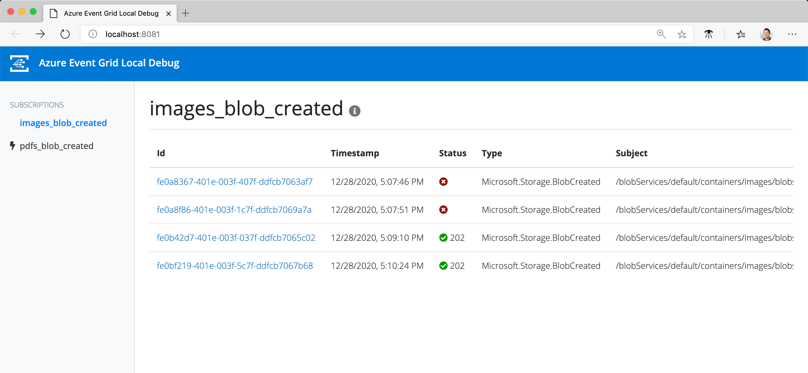

# Azure Event Grid Local Debugger

Utlity for relaying Azure Event Grid events to local webhooks via Azure Storage queues. This is an alternative to using an ngrok proxy to test local Event Grid webhooks.

- Automatically manages Storage queues and Event Grid subscriptions
- Relays Event Grid events via queues and invokes local webhooks
- Event replays - resend any command to local webhook
- Generate cURL command for any received event for running on command line or in Postman




## Quickstart

1. Install the package globally.

    ```bash
    npm install -g @anthonychu/event-grid-local
    ```

1. Create a config file named `event-grid-tunnel.yml`:

    ```yaml
    eventSubscriptions:
        images_blob_created:
            topic: /subscriptions/<subscription_id>/resourceGroups/<group>/providers/microsoft.storage/storageaccounts/<account> # resource id of Event Grid topic to subscribe to
            functionName: processImages # name of Azure Function to invoke locally when event is received
            filter:
                includedEventTypes:
                    - Microsoft.Storage.BlobCreated
                subjectBeginsWith: /blobServices/default/containers/images/blobs/
        pdfs_blob_created:
            topic: /subscriptions/<subscription_id>/resourceGroups/<group>/providers/microsoft.storage/storageaccounts/<account>
            webhookUrl: http://localhost:8080/mynodeapp/events # can specify a URL instead of a function name
            filter:
                includedEventTypes:
                    - Microsoft.Storage.BlobCreated
                subjectBeginsWith: /blobServices/default/containers/files/blobs/
    ```

1. Create a Storage account to use for relaying events from Event Grid in Azure to your local webhook URLs.

1. Set an environment variable named `EVENT_GRID_STORAGE_CONNECTION` to the Storage account connection string.

    ```bash
    export EVENT_GRID_STORAGE_CONNECTION="DefaultEndpointsProtocol=https;AccountName=<account_name>;AccountKey=<key>;EndpointSuffix=core.windows.net"
    ```

1. Create Storage queues and Event Grid subscriptions based on configuration in `event-grid-tunnel.yml`:

    ```bash
    event-grid-local subscribe
    ```

    You only need to run this command again when you change the configuration.

1. Start listening to Event Grid events:

    ```bash
    event-grid-local start
    ```

    The configured webhooks will be invoked whenever events are received from Event Grid via the queues.

1. To monitor incoming events and re-send (replay) commands, open the dashboard in the browser.

    http://localhost:8081/

---

This community project is not officially supported by Microsoft.
